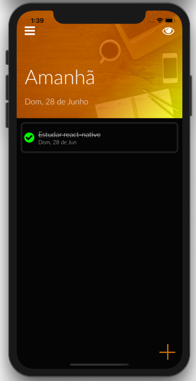

# Tasks

### A task controling tool.

Project developed with the react-native course from cod3r.

### Axios

- 0.19.0

Used to create HTTP requisitions to the backend, using local routes defined to the PostgreSQL database

### React-navigation-drawer

- 2.3.3

Side drawer navigation, obtained by the gesture on the side of the screen.

### Async-storage

- 1.7.1

Used to storage data on the phone, if the app is offline.
